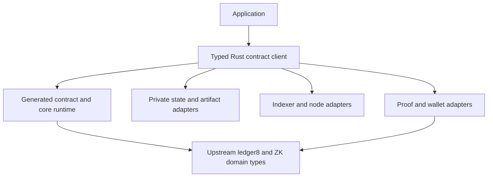

# CoPS-002 — Rust contract client and provider boundaries

Status: local testkit slice delivered in ADR0360/#497; broader application-client integration proposed, not a 0.3.0 gate
Date: 2026-10-08
Issue: [#496](https://github.com/MediaNoxLabs/compact/issues/496)
Related problem: [CoPS-001 — Ledger decoding resource limits](0001-ledger-decoding-resource-limits.md)

## Problem and user intent

The user asks whether Rust should have the same application-facing integration layer as the TS/JS stack, keeping network, I/O, proving and domain concerns isolated. Yes: that is a useful developer-experience investment. The reference is the provider/contract-client layer around generated contracts.

The current Rust branch already has upstream ledger domain objects, generated typed native/recorded calls, observations/checkpoints, transaction preparation and native proof integration. Much of the network, wallet and proving orchestration remains in tools/examples, with JS wallet handoff for network flows. The inspected surface lacks a comparably consolidated public Rust provider set and contract client. This is an integration packaging/API gap, not evidence that Rust lacks all network/proof capability or that the compiler cannot express the domain.

The retained sample in CoPS-001 means already-produced state/key artifacts measured for sizing. It is not a replacement for network support. The aggregate decoder resource limitation remains present in the inspected TS/ledger8 stack; missing Rust client interfaces did not cause it.

## Pinned TS/JS reference

MidnightJS v4.0.0 resolves to commit `dfc8208711f690ef7f146c7bec24b88a4c1c4ee3`. Its [provider collection](https://github.com/midnightntwrk/midnight-js/blob/dfc8208711f690ef7f146c7bec24b88a4c1c4ee3/packages/types/src/providers.ts) and [proof-provider adapter](https://github.com/midnightntwrk/midnight-js/blob/dfc8208711f690ef7f146c7bec24b88a4c1c4ee3/packages/types/src/proof-provider.ts) were read directly. The latter imports `@midnight-ntwrk/ledger-v8` and adapts the existing upstream `ProvingProvider`.

The inspected v3.0.0/v3.2.0 proof-provider files still import ledger-v7, so their similar interface names must not be mistaken for the ledger8 compatibility baseline. Mainstream Compact ledger-8 exposes runtime/ledger objects separately; MidnightJS supplies application coordination around them. This distinction applies equally to the proposed Rust design.

| Concern | MidnightJS boundary | Rust proposal / reuse |
|---|---|---|
| Private state | PrivateStateProvider | Storage adapter with explicit commit/failure behavior; reuse ContractLab expectations, no promise of rollback for arbitrary external side effects |
| Public chain state | PublicDataProvider | Indexer/node adapter returning explicitly observed state/checkpoint data; observation alone does not prove finality |
| ZK artifacts | ZKConfigProvider | File/cache/remote artifact source; reuse upstream resolver/key types and source identities |
| Proving | ProofProvider wrapping ledger ProvingProvider | Adapter over existing native/remote proving machinery; no replacement proof format |
| Wallet balance/sign | WalletProvider | Explicit wallet capability; reuse available wallet integration first, do not invent a second wallet/crypto stack |
| Submit/observe | MidnightProvider | Node submission and confirmation adapter, with operation-specific errors and explicit trust |
| Logging | Optional LoggerProvider | Redacted structured diagnostics; preserve privacy distinctions from ContractLab |

## Current Rust evidence

Pinned Rust source: `9ffd7880405ed5cfd62909ed4aac64a638c7fc02`.

- `runtime-rs/src/transaction.rs` exposes upstream VerifierKey and typed ObservedContractState/Observation, preparation and transaction construction.
- `runtime-rs/src/transaction/observation.rs` owns explicit checkpoint/observation/offer binding; callers supply trusted-source assumptions rather than gaining authentication from a wrapper.
- `runtime-rs/src/transaction/decoding.rs` owns exact decoding and explicit byte admission.
- `tools/compact-rust-proof-smoke/` and `examples/record_from_confirmed.rs` exercise actual native proof/provider and observed-call workflows.
- `tools/compact-rust-backend/wallet-live/check.mjs`, checkpoint and handoff modules coordinate JS wallet, indexer, node and prover access around Rust-exported artifacts.

This is a scoped source/API inventory, not a new network execution or claim that every Rust integration module was exhaustively catalogued.

## Proposed separation

Keep I/O policy in adapters: acquisition byte caps, I/O deadlines/cancellation, retry policy, caching and concurrency. Keep typed contract execution and ledger semantics in the existing generated/runtime domain. Preserve separate states for preparation, proof, balancing/signing, submission and observed confirmation using upstream types where available.

Do not copy every TS interface mechanically, introduce a trait per concrete type, or duplicate upstream ledger objects. Start with a small client module/crate and optional adapters; choose package splits only when their dependencies justify them. Keep HTTP/async dependencies out of generated contract/core execution by default.

## What this would and would not solve

It would reduce application glue, centralize configurable acquisition/decode policy, improve cancellation/error handling at I/O boundaries, and let deterministic test adapters and real services use the same client interface.

It would not establish aggregate decoder memory/CPU containment. A trait wrapper does not meter upstream allocations, and an async timeout does not by itself preempt synchronous CPU work. CoPS-001 remains a separate upstream/resource-contract problem even if this client layer is delivered.

## Original broader design probe (superseded for the current local-test slice)

Implement one Counter flow through the proposed client: obtain state and artifacts, execute a typed call, prepare/prove, balance/sign, submit and observe. Pair deterministic local adapters with a separately qualified real provider path. Reuse the existing proving/wallet capabilities and explicitly record any bridge needed. Then port one DID lifecycle through the same interfaces.

Acceptance for the probe: an unedited generated crate, small readable application code, preserved call/effect/privacy/error semantics, configurable resource policy, no fake proof/network equivalence from local simulation, and no duplicate ledger/cryptographic model. Actual network actions and credentials retain their own explicit scope.

Write the implementation ADR with before/after consumer examples once the prototype demonstrates useful boundaries. The proposed client/API names and package layout are not yet decisions. This is follow-up planning, not an added blocker for 0.3.0.

## 2026-10-08 — Owner-authorized local test scope

The owner confirmed direct official Resolver/ParamsProverProvider/ProvingProvider and domain reuse, then clarified a convenient reusable test runner is enough. ADR0360/#497 extends existing ContractLab with optional ProofLab; this is the first narrow delivery, not completion of the wider client/network integration proposal. No new state-reader or production adapter framework. Detailed product research is retained separately in the vault.

Delivery: signed commit `17433b40a14da83c5c500d92420149c28f755b88`, issue [#497](https://github.com/MediaNoxLabs/compact/issues/497). [ADR-0360 — Compose official ledger8 providers in an experimental client model](../rust/adr/0360-compose-official-ledger8-providers-in-an-experimental-client-model.md) records the smaller accepted scope and results. The broader network flow above remains an investigation, not work required to use ProofLab.
