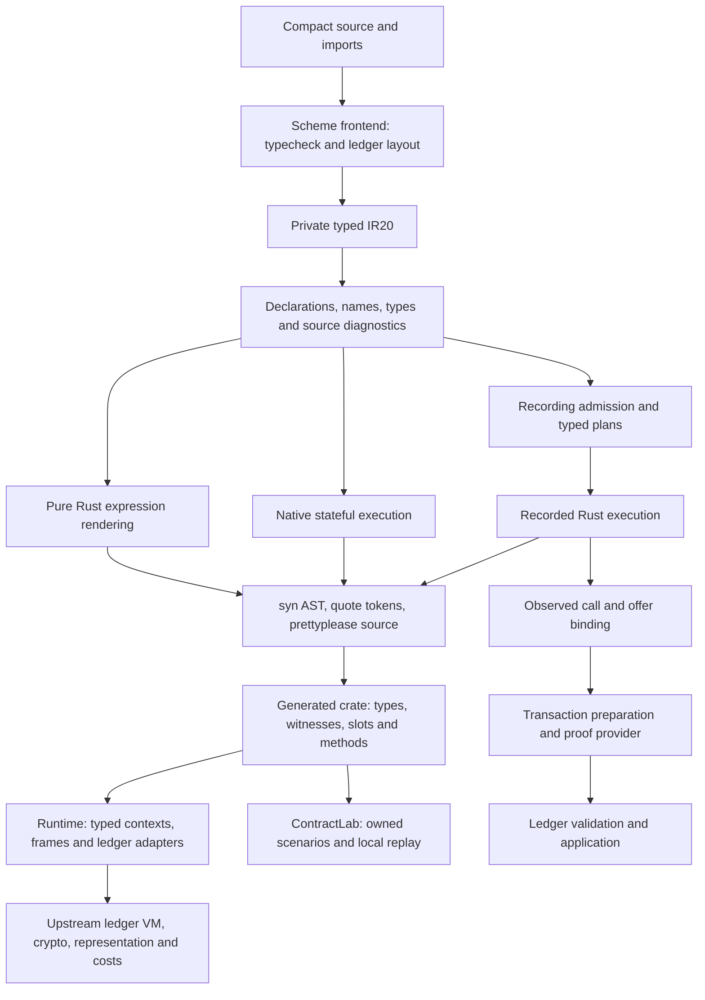

# Rust backend ownership and engineer navigation

Current architecture map, 2026-10-07, reconciled against `5efa91c2`. R030-01 checked domains and R030-05 component decomposition are accepted within their documented scope. This page identifies current owners and remaining design limits; it does not reopen accepted work or claim all internal profiles have one representation. Publish reviewed guidance under `doc/rust/` at closeout; preserve previous maps as history.

## Follow a contract through the system

Rust and TypeScript consume the same language/ledger semantics. The Rust backend owns its typed lowering, AST construction, generated API and runtime adapters. Upstream ledger/zk code remains the owner of canonical field/curve operations, aligned representations, VM operations, cost model and transaction rules. A second local interpretation of those rules needs its own justification and differential evidence.

## Where to make a change

All paths below are repository-relative navigation references.

| Concern | Code owner | Review obligation |
|---|---|---|
| Frontend typing, explicit disclosures and physical ledger layout | `compiler/rust-ir-passes.ss` and frontend passes | Preserve Compact semantics, exact IR version and source/import provenance |
| Typed IR declarations | `tools/compact-rust-backend/src/ir.rs` | New nodes must be handled or explicitly refused by affected renderers/admission paths |
| Public declaration namespace and source errors | backend `lib.rs` declaration validation / `RenderError` | Preserve duplicate/collision precedence and source location; raw Rust names share semantic namespace |
| Generated type declarations | backend `type_declarations.rs` | Preserve field order, FAB/hash/readback contracts and consumer name hygiene |
| Generated representation implementations | `runtime-rs-macros/src/struct_repr.rs` | Delegate upstream representation traits; positive and compile-fail hygiene tests |
| Witness trait/bridge emission | backend `witness.rs`, macros `witness_bridge.rs` | Typed arguments/results, private-state ownership and ordered private outputs |
| Call graph facts | backend `circuit_analysis.rs` | User witness dependency and native private output are distinct facts; audit transitive calls |
| Pure expressions and constructor assembly | backend `lib.rs`, shared `value_lowering.rs` | Ordered constructor/witness semantics; checked carrier/conversion syntax belongs to the shared value owner |
| Native stateful lowering | backend `stateful.rs` assembly, `stateful/expression.rs` expression effects, `stateful/facade.rs` methods, `native_frame.rs` simple leaves | Preserve actual source query order, gas and early errors; frame promotion is intentionally narrow |
| Recorded function assembly and legacy shape checks | backend `recorded.rs` | Preserve profile order and no partial admitted output; this remains the largest refactoring area |
| Bounded pure-call policies | backend `recorded/pure_calls.rs` (ADR0263 delivered) | Whole transitive admitted body, exact permitted value languages, no hidden effects |
| Typed composite plans | backend `recorded/typed_plan.rs` plus named domains | Audit declarations and every source branch before emission; checked types/slots and ordered effects |
| Shared Unit helper composition | backend `recorded/typed_plan/composition.rs` | Pure/local/recorded call distinction; fresh local scopes, complete helper graph, no implicit ledger access |
| Local crypto helper eligibility | backend `recorded/audited_local.rs` | Use existing native crypto helpers only after full eligibility checks and preserve witness work |
| Generated recording/observed facade | backend `recorded/facade.rs`, `recorded/helpers.rs` | Stable declaration-order parameters, shared body identity and collision-free helper names |
| Capability classification | backend `capabilities.rs` | Join authoritative proof flags atomically; pure not-applicable differs from missing recording |
| CLI/distribution identity | backend `src/bin/compactc.rs`, compatibility module (ADR0261 delivered) | Check selected runtime pair before replacing output; metadata is developer mismatch detection |
| Runtime values and crypto adapters | `runtime-rs/src/primitives.rs`, `natives.rs`, `opaque.rs` | Canonical versus reduced scalars, declared bounds and upstream-owned primitives |
| Typed ledger descriptors | runtime `slots.rs`, `ledger/{cell,counter,collections,merkle,kernel}.rs` | Resolve declared physical paths and types; execute canonical upstream programs |
| Native execution ownership | runtime `context.rs`: `CircuitContext`, `CircuitFrame`, `CircuitResult` | Context/private state/query gas transfer and witness read metering |
| Recorded execution ownership | runtime `recording.rs`: `RecordingFrame`, `RecordedCircuitResult`, `PublicTrace` | Ordered Verify ops, sealed trace, context-policy safety and state/effects replay agreement |
| Observed inputs and funded offers | runtime `transaction.rs`, `transaction/observation.rs` and placement/transients modules | Address/entrypoint/input/state binding, exact offer ownership/allocation, explicit trust provenance |
| Local test scenarios | `testkit-rs/src/{lab,environment,snapshot,witness,report,error}.rs` | Owned checkpoint commit/rollback, explicit environment and redacted diagnostics; trusted callbacks |
| Proof and application qualification | `tools/compact-rust-proof-smoke` | Actual provider/material identity, independent proof verification, strict ledger rules and applied state |

## Values and evidence are different types of claim

A `Type::Field` expression in IR records a source type; the generated runtime Field delegates its arithmetic to the pinned upstream primitive. A typed `CellSlot<T>` associates a declared physical slot with its value representation. Neither type establishes that a caller-supplied observed state came from a trusted chain.

`CircuitResult` carries native output/context and query-summed cost. `RecordedCircuitResult` adds a sealed public trace. `ContractLab::recorded` replays that trace with the actual VM and commits only after checks pass. An observed prepared call binds a specific state/address/entrypoint/input and its explicitly supplied offer policy. Proof verification and ledger admission require their own execution receipts.

For review, keep these questions separate:

1. Does the source compile and is the public export correctly classified?
2. Does the typed Rust method execute with the expected value/error and witness ordering?
3. Does its recorded VM program replay to the same state/effects at the measured cost?
4. Is the call bound to the selected observed state/inputs and exact offers?
5. Does its real proof verify, and does default-strict ledger validation/application succeed?
6. Was an actual network submission observed, where a network claim is needed?

## Public extension points and private implementation details

Consumers use generated types, generated `TryWitnesses`, typed slots/methods, runtime context/transaction adapters and ContractLab's typed callbacks. Source-root selection and published compatibility records describe supported pairing; their values do not authenticate a malicious source tree.

The private IR, shape-specific recording profiles, internal `Plan` domains, temporary identifiers and helper implementation functions are compiler internals. Capability reports are the per-export availability contract. Existing `RecordingOutcome` distinguishes supported output from a structured gap. ADR0266 adds a private `ProfileAttempt` for the bounded shielded-send profile: `NotApplicable`, `Rejected(RecordingGap)` and `Admitted(plan)`. Rejection preserves the first unsupported nested expression after later eligible profiles have had their opportunity; native/action/effectful diagnostics retain precedence. Other optional profiles are not universally migrated. R030-01 acceptance uses the representative checked domains and the explicit lexical-map design decision described below. Other profiles retain their existing boundaries.

## Maintenance rules and deliberate limits

- Preserve the whole-body audit distinction while reducing duplicate slot/type/call invariants. Do not merge evaluators merely because their match arms look similar.
- Shared semantic Rust function-name ownership is delivered in `naming.rs` (ADR0264). Declarations and recorded helper names use the same normalization and raw-identifier equivalence; namespace checks remain distinct from source frontend grammar.
- `recorded.rs` still contains a very large assembly/selection function; the pure policy extraction improves navigation but does not solve profile selection or scope identity.
- `stateful.rs` and root `lib.rs` retain expression/constructor orchestration. Further movement needs a cohesive responsibility and characterization tests; file size alone is not an acceptance criterion.
- New context/policy fields must be classified at helper and recording safety boundaries. Fields omitted from comparisons must have an explicit semantic reason.
- Retain runtime checks at untrusted input boundaries even when generated Rust catches ordinary misuse statically.

See “Code quality assessment” (historical vault reference; not bundled here), [Testing generated contracts with ContractLab](contract-lab.md), the accepted ADR index and the current delivery dashboard for measured evidence and outstanding acceptance.

## Local helper boundary owner — ADR0275

`runtime-rs/src/context/local_boundary.rs` owns the consuming internal `CircuitContext::call_local_checked` boundary. It can classify private context fields without exposing them. It snapshots query/wallet/intent/cost policy once, calls the supplied helper, and validates unchanged public policy. `RecordingFrame::call_local` owns adoption and ordered private-output/gas accumulation only. Upstream and locally owned record patterns are exhaustive; new fields demand a visible policy choice. Private state is intentionally allowed to change. The boundary does not attest transient arbitrary Rust callback actions or external aliases.

`testkit-rs/src/environment.rs` separately owns lab policy application and snapshot comparison. Address is assigned when the lab builds its context; fixture seed is provenance, and a None key is not a reset command. This policy is intentionally distinct from local-helper equality.

## Guarded mutation profiles — ADR0277

`tools/compact-rust-backend/src/recorded/guarded_mutations.rs` owns four bounded families: organizer Set admission, authority-prefixed optional Cell writes, authority-prefixed enum advancement, and witness-admitted Merkle insertion. Their shared `AuthorizedContinuation` and authority-prefix check remain private. `recorded.rs` owns ordered profile selection, diagnostics and recording assembly. To change a profile's admitted source shape, start in this component and its existing admission tests; to change selection precedence, inspect the parent. This move does not widen any supported shape.

## Shared value and native emitter navigation — ADR0279/0280

- `value_lowering.rs` maps typed Compact values to Rust carriers and emits checked scalar/aggregate conversion, arithmetic and retention syntax. It delegates runtime operations; it does not execute the ledger or classify whole-circuit admission. Its private module is a shared leaf for pure/native/recorded emission. Root imports retain current internal caller paths.
- `stateful/expression.rs` owns recursive native expression lowering and ordered query/witness effects. It retains the existing explicit context arguments and recursive arm ordering.
- `stateful/facade.rs` owns public native method signatures, witness bounds and forwarding calls. It contains no VM lowering.
- `stateful.rs` owns native frame selection and the lexical action/return work stack. `circuit_analysis.rs` remains the dependency-analysis owner.

Existing scalar/tuple/aggregate tests and terminal-scope/witness/constructor scenarios exercise the boundaries. The full 183-source output differential protects source emission and capability classification. File relocation does not reduce the complexity of the expression match or circuit work stack; changes to either still require semantic tests.

## Checked domain outcomes and lexical representation — ADR0284/0286

Delivered design, 2026-10-07; ADR0286 integrated at `1705fc1a`. These decisions are part of the accepted representative-domain model.

`recorded/profile_attempt.rs` owns the private `ProfileAttempt<T, E = RecordingGap>` outcome. Shielded-send (ADR0266) and Unit composition (ADR0286) distinguish signature-not-applicable, bounded-domain rejection and a complete admitted plan. Other optional profiles are not universally migrated. `typed_plan/composition.rs` owns whole-graph Unit auditing and typed failure metadata; `recorded.rs` retains selection and diagnostic precedence. Pure guards/values, read-only helper alternatives and witnessed Unit branches are representative controls; pure exports do not enter this stateful router.

A domain rejection does not establish globally malformed IR: a distinct profile may independently validate the original input and produce its complete plan. No rejected prefix, cache or effect list is reused. Native located errors and concrete recursive legacy gaps win. Only a coarse direct root CircuitCall refusal may be refined by the same action's concrete audit failure; typed root ordinal, phase and precision control this, never diagnostic path strings. Capability and generated API schemas remain unchanged.

ADR0284's actual-emitter comparison did not justify BindingId/Rc promotion. Keep current typed lexical maps, fresh caller/callee scopes and checked declaration references. This conditional design disposition does not assert universal scope/resource safety. See “ADR0284 — Lexical scope and binding identity decision” (historical vault reference; not bundled here), “ADR0286 — Checked Unit composition delivery” (historical vault reference; not bundled here) and “R030-01 representative checked-admission acceptance mapping” (historical vault reference; not bundled here). The acceptance mapping records the parent decision and its bounded criteria.
