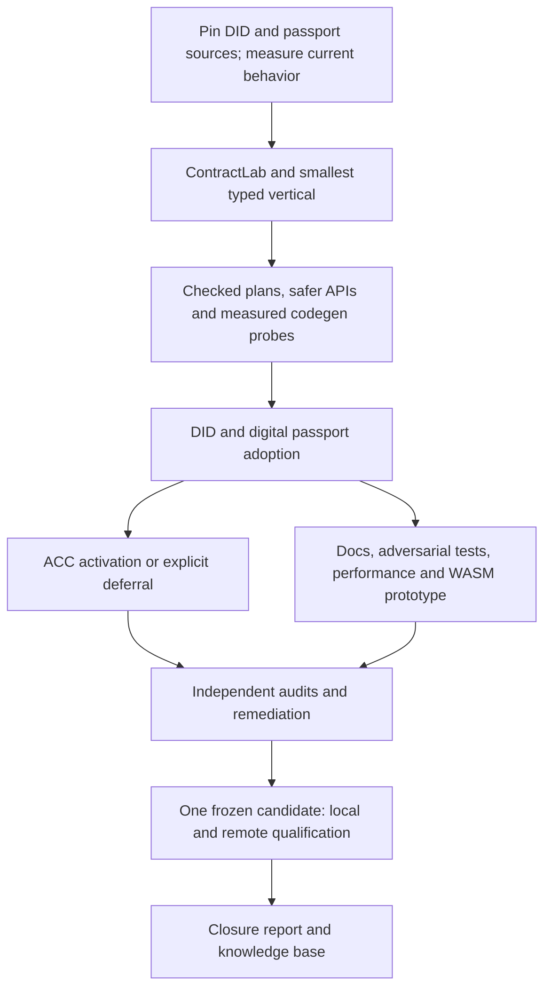

# 0.3.0 — Typed runtime, usable generated Rust and contract adoption

**Status:** proposed delivery plan, 2026-10-07. This is planning work; implementation has not started. The 20 work packages are drafted locally, not created as GitHub issues. Working branch: `codex/rust-backend-ast`.

**Planning baseline:** [`939b7aaa`](https://github.com/MediaNoxLabs/compact/commit/939b7aaaab7ff346149746dc8fce8bd29705b1d9), after ADR publication. The previous implementation acceptance remains [`03c03a39`](https://github.com/MediaNoxLabs/compact/commit/03c03a39a2d39c43c91143b9526ca1c2ffae706c). Neither historical acceptance nor this plan claims that the new target contracts already pass.

[Detailed backlog and acceptance checklists](backlog.md) · [Machine-readable work packages](backlog.json) · [Contract target provenance](targets.md) · [Published ADR register](../../adr/README.md)

## Outcome

Make generated Rust a practical, well-tested way to develop real ledger-8 Compact applications: understandable types and APIs, explicit semantic ownership, safer construction boundaries, a deterministic testkit, strong contract regressions and documentation usable outside this repository.

Preserve the existing AST emitter and upstream ledger/zk primitives. Improve the checked model and shared semantic operations in small slices. Generated code should expose ordinary typed Rust, with selective derives/macros for mechanical repetition.

## Confirmed user decisions

- **DID:** adopt the upstream **v0.7.0 release**, with an immutable source/import/toolchain manifest. Do not silently substitute a later main-branch revision.
- **Digital passport:** use **`midnightntwrk/midnight-vc-passport`** as the integration root; propose pinned `develop` at `2e13b029` for its latest merged contributions, following stable `credential-compact` 0.2.0 and preserving `main`/RC5 as comparisons. A similarly named contract repository is not an interchangeable source.
- **Passport ACC:** create a **deferred placeholder**. Select its source and ledger-9-to-ledger-8 scope only after DID and digital passport adoption. No early ACC port or expensive proving experiment is scheduled.
- **External audit:** independent external **coding-agent review**, clearly labeled; no human security-audit claim.
- **WASM:** interpret “wast” as WebAssembly for Node.js and browsers. This is a bounded feasibility prototype, not an unconditional production target or browser-prover promise.

`0.3.0` is currently the milestone name. Compiler version, Rust crate SemVer, runtime ABI, private IR schema, capability schema and upstream ledger versions are distinct. Work package16 defines their release relationship before any version changes.

## Twenty deliverables

Numbers 1–15 match the user's requested outcomes; 16–20 add supporting release criteria.

| # | Deliverable | Completion evidence |
|---|---|---|
| 1 | Crystallize runtime/domain models | Ownership/invariant map; structured admission and checked plans; migrated slices preserve scope and effects |
| 2 | Improve generated code iteratively | Repeated before/after probes and measured usability, build/resource and diagnostic results |
| 3 | Strengthen primitive/API safety | Documented misuse guarantees, checked construction, compile-fail and dynamic rejection tests |
| 4 | Selective macros/derives and shared helpers | Duplication inventory, ordinary-Rust comparison, expansion/hygiene/layout equivalence |
| 5 | Address SOLID/KISS/DRY gaps | Concrete coupling/invariant fixes with narrow interfaces and differential tests |
| 6 | `midnight-compact-testkit` / `ContractLab` | Typed deterministic scenarios over the real ledger VM; snapshots, witnesses, reports and explicit test levels |
| 7 | Generated-code coverage | Export/case/dimension matrix plus instrumented component coverage and security obligations |
| 8 | Developer documentation | Tested tutorials, rustdoc, external consumers, migration and troubleshooting guides |
| 9 | DID v0.7.0 adoption | Required exports/lifecycle, negative cases and strict proof/application evidence on pinned sources |
| 10 | `midnight-vc-passport` adoption | Pinned pure-family/core closure, direct value/error/codec scenarios and truthful proof applicability |
| 11 | Minimized compatibility regressions | Original failure → minimal Compact snippet → root cause → fix → original-contract retest |
| 12 | ACC placeholder | Explicitly deferred; activation/scope decision after 9/10, with no claim of adoption from a placeholder |
| 13 | Internal + external agent audits | Architecture/security/functional/nonfunctional reviews, verified findings and independent retests |
| 14 | Closure report | Domain/code examples, delivery ledger, parity/coverage/audit/resource results and remaining limits |
| 15 | Node/browser WASM feasibility | Two small verticals and either measured supported subset or exact blocker report |
| 16 | Compatibility and migration contract | Version/feature/MSRV/source matrix, old/new consumer compatibility and actionable mismatch failures |
| 17 | Adversarial/property/differential assurance | Threat model, finite invariant obligations, malformed-input corpus and targeted mutation/fuzz evidence |
| 18 | Performance/resource budgets | Reproducible cold/warm builds, execution, memory/stack, artifact/proof cost and measured tradeoffs |
| 19 | Reproducible local delivery pipeline | Immutable compiler handoffs, focused checks, provenance, dependency review and bounded parallel ownership |
| 20 | Final candidate qualification | Clean external consumers, supported hosts/features, exact-revision local/remote gates and migration checks |

Dependencies describe named readiness checkpoints, not closure of each prerequisite package; final qualification independently checks all applicable acceptance criteria. Every row has dependency and acceptance details in [the backlog](backlog.md). These are work packages, not a promise of exactly 20 implementation commits or issues. New discovered primitive failures become small linked children without weakening the parent contract acceptance.

## Sequence and decision gates

| Wave | Work | Gate before expanding |
|---|---|---|
| A — Baselines | Pin DID/passport closure; compatibility16, threat model17, measurement18, local pipeline19; capture original source/export/behavior baseline | No missing or ambiguous source imports; actual current compiler failure map; initial budgets and semantic obligations recorded |
| B — First vertical | Minimal ContractLab6; model1 and safety3; composition/diagnostic slice; generated-code probes2, selective abstraction4/5; coverage7 | Small Counter → witnessed Cell → collection/helper branch passes with typed witnesses, exact state/trace/gas and negative guards |
| C — Contract adoption | DID9, digital passport10, reduction/fix loop11; extend testkit and models only as the contracts require | Both pinned real contracts work through unedited generated crates; all required exports and security/lifecycle paths have direct evidence |
| After C — ACC decision | Activate placeholder12, select source and classify ledger downgrade feasibility | Adopt a concrete scope/acceptance plan or explicitly defer it; never count missing security features as successful downgrading |
| D — Hardening | Iterate generated API/code research; docs8, assurance17, measurements18, bounded WASM15, internal/external review13 | No unresolved critical/high security or correctness findings; planned coverage and consumer guides pass; experimental scope labeled |
| E — Qualification | Frozen candidate20, final scoped local/remote validation, closure report14 and knowledge-base reconciliation | Every required gate has exact-revision evidence; optional/deferred outcomes are explicit |

Architecture changes and contract adoption are interleaved. Baseline the real contracts first; do not spend a large refactoring phase discovering their required primitives only at the end.



## Research-backed architecture direction

The current code already has typed slots, checked integer carriers, sealed trace metadata, runtime offer reconciliation and mechanical derives. Reuse them. The main opportunities observed at the planning baseline are:

1. **Compositional admission:** `recorded.rs` contains ordered whole-circuit profile alternatives; `typed_plan.rs` mixes policy checks, lexical environments and syntax construction. Preserve proven profiles while introducing explicit admitted/not-applicable/rejected results and a checked internal plan. An effect bitset alone cannot prove operand identity or per-path safety. See [profile selection](../../../../tools/compact-rust-backend/src/recorded.rs) and [typed planning](../../../../tools/compact-rust-backend/src/recorded/typed_plan.rs).
2. **Runtime invariants:** public context mutation and local-helper snapshot comparison are functioning safeguards with maintenance costs. Explore a narrower helper capability and a single owned invariant boundary, retaining runtime checks during migration. See [context](../../../../runtime-rs/src/context.rs) and [recording](../../../../runtime-rs/src/recording.rs).
3. **Typed consumer boundaries:** probe generated argument records/descriptors, canonical scalar construction, checked offer-policy variants and explicit query-versus-replay gas vocabulary. Preserve source-level semantics and exact retained offers. See [transaction APIs](../../../../runtime-rs/src/transaction.rs) and [native primitives](../../../../runtime-rs/src/natives.rs).
4. **Dependency/platform boundary:** the runtime's base graph includes crypto, proof and Zswap dependencies even without `ledger-transaction`. `--no-default-features` is not already a VM-only runtime. Inspect the target-specific graph before proposing a feature split; a lockfile dependency alone does not prove a WASM blocker. See [runtime manifest](../../../../runtime-rs/Cargo.toml).

The emitter files are large (`recorded.rs` 9,451 lines, `stateful.rs`4,056, `lib.rs`4,098 at 939b7aaa), but line count alone is not a design defect. Measure changes in semantic duplication, coupling, comprehensibility and regression risk.

### Candidate model — subject to ADR/probe, not an accepted API

```text
Compiler-typed IR + source spans
  → resolved lexical/circuit/slot identities
  → reachable-call and ordered effect analysis
  → checked admission plan with typed failures
  → native / recorded Rust AST construction
  → ordinary generated Rust APIs
  → runtime slots / checked values / frames / transaction binding
  → upstream ledger-8 VM, codecs, cryptography and proof primitives
```

The target audit found two immediate acceptance distinctions: DID v0.7.0 declares JS ledger-v8 **8.1.0**, while the Rust baseline pins **8.0.3**; compatibility or a coherent pin update must be demonstrated. Digital passport currently consists of **pure validation/value circuits**, so authoritative compiled exports and direct value/error/codec tests matter; ledger transactions must not be fabricated to fill a proof column. See [target evidence](targets.md).

First consolidate a read-only Cell/helper composition; then a witnessed branch; then a funded profile. Retain native/recorded differences where their evidence obligations differ. Avoid one universal flag that enables all combinations or source-name matching for real contracts.

### API probe example

The exact public API will be decided through an ADR and working consumer; this example is illustrative:

```rust
let scalar = CanonicalJubjubScalar::try_from(field)?;
let args = calls::UpdateDocumentArgs { document, authority };
let call = contract.recording().update_document(observed, private_state, args)?;
let prepared = bound_offer.prepare(call, verifier, commitment_randomness)?;
```

Named inputs and canonical values can prevent specific Rust misuses. They do not authenticate a wallet, an installed verifier or network finality by themselves. Keep dynamic validation for untrusted bytes and explicitly available low-level integration APIs.

### Macro policy

- Prefer ordinary functions for shared runtime operation/gas/context mechanics.
- Use derives or small attributes for mechanical representation, argument or witness glue with useful compiler diagnostics.
- Keep semantic typing, provenance and admission in the compiler domain model.
- Preserve explicit effectful control flow in generated code unless a measured helper/DSL probe improves it.
- Require expanded-code equivalence, type-error examples, hygiene, compile cost and consumer evidence. “More macros” and “fewer generated lines” are not success metrics.

This evolves the prior decisions, including [typed runtime DSL](../../adr/0005-use-a-typed-runtime-dsl-instead-of-a-body-wide-macro.md), [same-frame helpers](../../adr/0016-reuse-recorded-callee-bodies-within-one-frame.md), [partial diagnostics](../../adr/0079-explain-missing-rust-recording-capabilities-from-typed-lowering.md) and [boxed private recording state](../../adr/0210-private-recording-storage-and-default-debug-worker.md).

## ContractLab and coverage contract

Proposed package **`midnight-compact-testkit`**, main API **`ContractLab`**; naming/registry availability is not a publication commitment. It calls ordinary generated typed methods through closures and witness traits and runs the real upstream VM. It is a dev dependency, separate from generated production dependencies.

| Level | What passes | What it does not establish |
|---|---|---|
| Native | Typed result/state/error, witness journal and query cost | Recorded proof transcript or a cryptographic proof |
| Recorded/replay | Exact Verify operations, state/effects/private alignment and replay | Proof or ledger transaction admission |
| Proof/application | Default-strict funded preparation, actual proof/verify/apply, ownership/nullifiers and phase semantics | Network observation authentication |
| Network | Named node/indexer profile, deployment/call/recovery and finalized observation evidence | Universal consensus authentication beyond the chosen adapter's trust model |

The lab owns snapshots, seed/clock/configuration and per-scenario witness journals. Restoring a checkpoint must not create a confirmed/offer-bound state from a provisional state. Failed generated calls consume context and do not generally expose a partial trace; preserve lab checkpoint state and report only observed failure evidence. External witness side effects cannot be implicitly rolled back.

**Proposed measurable floors**, to be established against the first baseline rather than reported as already achieved:

- 100% of required pinned imports/exports classified; every required DID/passport export directly exercised, with constructors tested where present. No transitive call or constructor-only analogue substitutes for the boundary under test.
- 100% of the finite, enumerated changed security/semantic obligations tested, including error classes and effectful branches where present. This is not exhaustive input-space coverage.
- At least90% line coverage for new testkit-owned code and 95% changed-line coverage for owned backend/runtime/testkit changes, reported per component with justified exclusions. Generated line coverage accompanies the export/case matrix.
- Every proof-applicable required contract export has a valid strict proof/application case; distinct authentication/effect paths get separate cases. Pure or legitimately non-proof-applicable exports have an explicit classification, never fabricated proofs.
- Each new recording family has independent TS/upstream boundary evidence; known provider differences are labeled instead of normalized away. Threat-model mutations verify critical guards actually detect faults.
- Repeated isolated fixture scenarios have identical semantic receipts under pinned seeds/checkpoints. Proof/encryption randomness and wall time are separate dimensions.

Use line/region coverage on the pinned stable toolchain. `cargo-llvm-cov` currently documents branch coverage as optional and nightly-dependent; a branch toolchain lane needs its own pin. Rustdoc supports runnable and compile-fail examples for consumer safety. [Coverage tooling](https://github.com/taiki-e/cargo-llvm-cov), [Rustdoc tests](https://doc.rust-lang.org/rustdoc/write-documentation/documentation-tests.html).

## WASM prototype

Run a bounded dependency diagnosis, then two verticals: pure arithmetic/hash and stateful Counter/witnessed Cell, freshly generated and unedited, in both Node and a headless browser. Use lossless bytes/large-integer transport and explicit witness adapters. Capture target features/imports, compressed size, startup, peak linear memory, results/state/replay and error behavior.

Start with `wasm32-unknown-unknown` plus a thin binding layer. Rust documents filesystem and thread limitations for this target; host-dependent paths need explicit design. WASI success alone is not browser support. A validated subset or an exact blocker/minimal reproducer is a legitimate prototype outcome; no fake VM, global fake entropy or native subprocess may be presented as WASM execution. Full browser proving and wallet recovery remain outside this experiment. [Rust target guide](https://doc.rust-lang.org/rustc/platform-support/wasm32-unknown-unknown.html), [wasm-bindgen testing](https://wasm-bindgen.github.io/wasm-bindgen/wasm-bindgen-test/usage.html).

## Audits, performance and delivery discipline

- Audit architecture, security, functional and nonfunctional requirements using the same traceability matrix. Internal reviewers and a separately configured external coding agent review exact frozen source. Record independence, tool/model, findings, fixes and retests. This is agent review, not human security certification.
- No open critical/high security or correctness issue at closure. Medium/low findings need explicit disposition and residual-risk rationale; a mandatory contract failure cannot be waived through an audit label.
- Measure cold/warm compilation, source/artifact size, runtime, allocations, default-worker stack, memory and proof resources on pinned profiles/hardware. A proposed >10% median regression triggers investigation and review using repeated paired samples; it is not a verdict from one noisy run. Freeze hard resource ceilings after baseline.
- Reuse focused local checks and immutable compiler handoffs. Parallelize independent slices; serialize shared emitter/runtime edits and final integration. Run wider gates for ABI/IR/effect changes, with the full applicable local suite and required remote validation at one final candidate after required local implementation/acceptance prerequisites pass, excluding remote qualification and final reporting.
- Review pinned dependencies/licenses/advisories, exact package inputs and external consumer portability. The currently declared Rust 1.88 minimum needs independent verification from the accepted Rust 1.99 evidence. Cargo's resolver behavior is not an MSRV test. [Cargo resolver](https://doc.rust-lang.org/cargo/reference/resolver.html), [SemVer guidance](https://doc.rust-lang.org/cargo/reference/semver.html).

## Research and decision cadence

Record generated-code probes at four checkpoints: current baseline, first model/testkit vertical, real DID/passport adoption and release-candidate review. Revisit a design earlier if a compatibility regression or measurement exposes a concrete problem. Each probe compares before/after code and at least one simpler alternative.

For each accepted change: problem/reproducer → proposed ADR with before/after/ownership/compatibility → focused issue → milestone assignment → implementation and focused checks → integration → measured delivery/amendment. Continue `RUST-ADR-NNNN` after the next available number; do not pre-allocate or accept a batch of speculative designs. Git remains canonical for published ADRs; Obsidian holds research and the ongoing decision story.

## Closure rule

DID v0.7.0 and the pinned `midnight-vc-passport` dependency closure **must work**, with no missing required primitives, patched generated Rust or weakened contract checks. ACC has the user-approved deferred placeholder and an explicit later scope decision; if activated, its approved gates become part of closure. WASM reports its actual experimental result.

The final report maps every required work package to code, ADRs, issues, tests, audits, supported platforms/features and immutable receipts at the candidate revision. It distinguishes coverage availability from behavior, proofs and live evidence. Publication of tags, registries or upstream changes is a separate delivery decision; the milestone name does not itself authorize a version bump or deployment.
